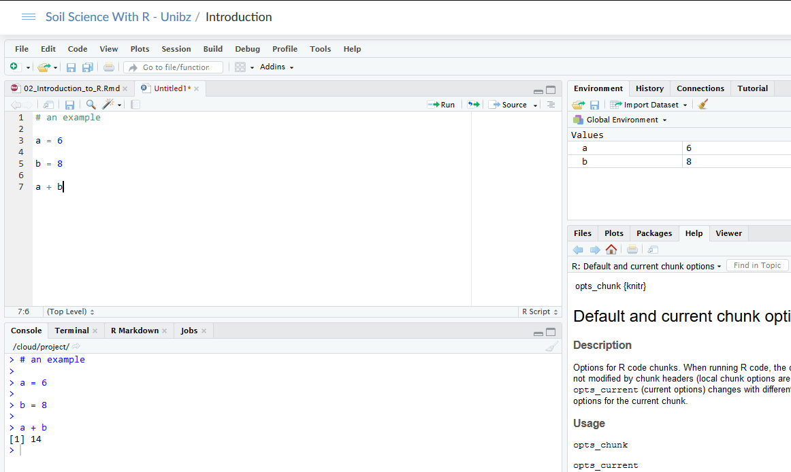
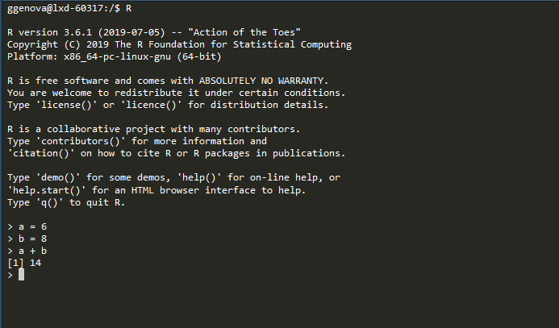
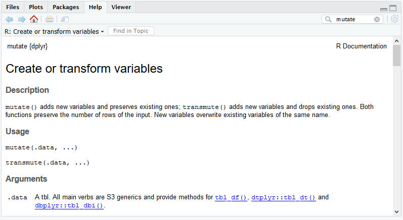
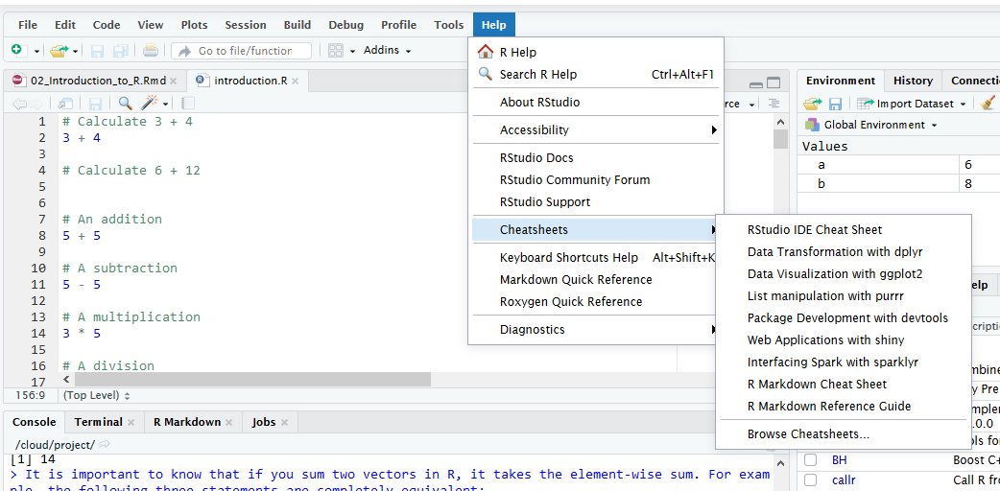
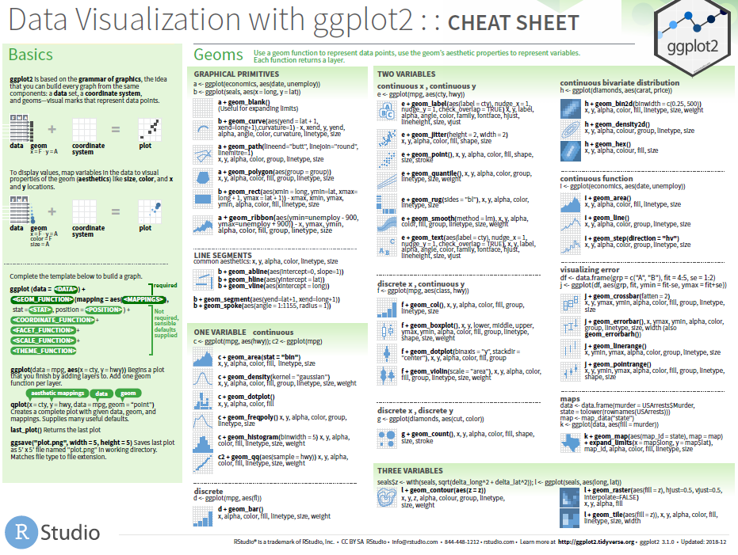
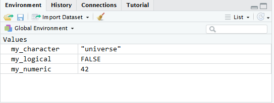

```{r setup, include=FALSE}
knitr::opts_chunk$set(echo = FALSE,fig.width = 4)
```

## About us - Lecturer and participants

Let's meet each other.

I'm Giulio Genova

Phd student in Soil Science at Unibz and Eurac

I work with R since my master thesis in 2017

<br/>
 
 


<br/>
<br/>
<br/>
<br/>
<br/>
<br/>

contatct: giulio.genova@eurac.edu 

## List of lectures for the course

- **Intro to the course, R and RStudio**
- Data wrangling exploring and summarizing with dplyr
- Plotting with ggplot2
- Cluster analysis or Principal component analysis

## Expectations or ideas?
<br/>
<br/>
<br/>

- I'd like to have an "hands on" approach on the software
- It would be nice to give you and head start on your future work
- The course is flexible and we can try to meet your needs


## List of topics for today

- What is R and why we use it
- Where to find help and documentation
- How to use R:
  - RStudio Cloud
  - Variables and environment
  - data type and structures
  - basic commands
- Some practice


## What is 

R is a programming language widely used in the academic world

It is, together with python, the language of Data Science

Born for statistics, today does lots of different things (like [web applications](http://meteobrowser.eurac.edu/a), presentations (like this one), books)


## What is 

Ok, but what is a programming language?

"A programming language is a set of commands, instructions, and other syntax use to create a software program. Languages that programmers use to write code are called "high-level languages." This code can be compiled into a "low-level language," which is recognized directly by the computer hardware."


## What is 

A programming language lets us write human readable code ad translates it into machine code for computation

R is an interpreted language


                  Text file --> 010101010 --> output

## What is R

 is not 

- R is the programming language
- RStudio is a (very nice) IDE (integrated develogping environment)

We mainly use RStudio to write and execute R code


## What is R

This is how RStudio looks like:


<br/>
<br/>
<br/>
<br/>
<br/>
<br/>
<br/>
<br/>
This is R if you use it from the command line:


## Why R ?

Lots of reasons!


## Why R ?

Almost any analysis, algorithm, procedure, etc. is implemented in R. And if not, there is probably a way to access it from R.
<br/>

R community produces code at a very high speed, making it an always up-to-date tool.
It is actually hard to keep up with the development.

<br/>
Even if you just use it for your thesis it's worth learning it


## Help and documentation
Where do I go to find help if something goes wrong?

- R has integrated documentation. We will take a look at that
- [StackOverflow](https://stackoverflow.com/)
- Topic specific forums or blogs
- [Github](https://github.com/) If the package you use is there



## Help and documentation
Where do I go to find out more about this?

- [RStudio's webinars](https://resources.rstudio.com/webinars)
- Books: [R for Beginners](https://cran.r-project.org/doc/contrib/Paradis-rdebuts_en.pdf) -  [Introduction to R](https://cran.r-project.org/doc/manuals/r-release/R-intro.pdf) - [R for Data Science](https://r4ds.had.co.nz/)
- [R-Bloggers](https://www.r-bloggers.com/)
- [Rdocumentation](https://www.rdocumentation.org/)
- [BolzanoR](https://rmeetupbz.pages.scientificnet.org/website/)
- Online courses: [DataCamp](https://datacamp.com/) - [Udemy](www.udemy.com/) - [Coursera](www.coursera.org) - [Edx](https://www.edx.org/)
  
## Help and documentation

RStudio CheatSheets. Great tools to get tips on the go



## Help and documentation

RStudio CheatSheets. Example of the ggplot2 Cheat Sheet




## How to use R

We will use [RStudio Cloud](https://rstudio.cloud/).
You will need to register or sign in with Google (If you have a Google account I suggest that, it is very easy).

If you still need to do that you can take a moment now


## Variables

In a programming language a variable is one of the most important concepts.

A variable has a name and a value

When you "call" the name you access its value

## Declare variables of different types
We declare a variable wit "<-" or "="
```{r declare vars, echo=TRUE}
my_numeric <- 42
my_character <- "universe"
my_logical <- FALSE 
```
## Print the variables
We print variables simply writing their names
```{r , echo=TRUE}
my_numeric
my_character
my_logical
```

## Check variable types
Check class of my_numeric my_character and my_logical
```{r , echo=TRUE}
class(my_numeric)
class(my_character)
class(my_logical)
```

## Environments

Environments are where variables live

We mainly see the Global environment but there can be many environments

Environments do not communicate with each other



## Data format: vector

Vectors can only be of one data **type**
```{r , echo=TRUE}
numeric_vector <- c(1, 10, 49)
character_vector <- c("a", "b", "c")

numeric_vector
character_vector
```

## Data format: vector

Vectors can have names
```{r , echo=TRUE}
names(numeric_vector) <- c("one", "two", "three")
names(character_vector) <- c("first_letter",
                             "second_letter",
                             "third_letter")

numeric_vector
character_vector
```

## Data format: factor
To create factors in R, you make use of the function factor(). First thing that you have to do is create a vector that contains all the observations that belong to a limited number of categories. For example, texture_vector contains the texture class of 5 different individuals:
```{r , echo=TRUE}
texture_vector <- c("Sandy_Loam","Clay_Loam","Silty_Clay",
                    "Clay_Loam","Sandy_Loam")
```

It is clear that there are three categories, or in R-terms 'factor levels', at work here: "Sandy_Loam", "Silty_Clay" and "Clay_Loam".

## Data format: factor

The function factor() will encode the vector as a factor:
```{r , echo=TRUE}
factor_texture_vector <- factor(texture_vector)
factor_texture_vector
```
## Data format: matrix
In R, a matrix is a collection of elements of the same data type (numeric, character, or logical) arranged into a fixed number of rows and columns. Since you are only working with rows and columns, a matrix is called two-dimensional.

You can construct a matrix in R with the matrix() function. Consider the following example:
```{r , echo=TRUE}
my_matrix = matrix(1:9, byrow = TRUE, nrow = 3)
```

```{r , echo=TRUE}
my_matrix
```
## Data format: lists
Lists are like vectors but can have any type or structure as elements

Let's create our first list! To construct a list you use the function list():
We put the elemts created so far:
```{r , echo=TRUE}
my_list <- list(my_character,my_numeric,my_logical, 
                factor_texture_vector,my_matrix)
```
## Data format: print the list

```{r , echo=FALSE}
my_list 
```

## Data format: Data Frame
A data frame has the variables of a data set as columns and the observations as rows
```{r , echo=TRUE}
mtcars 
```

## Data format: Data Frame
Data frames are basically a list of columns of the same type
```{r , echo=TRUE}
class(mtcars)
```

## Data format: Data Frame
You can access columns of the DataFrame using the $. 
```{r , echo=TRUE}
mtcars$mpg
```

The class of the "column" is...

```{r , echo=TRUE}
class(mtcars$mpg)
```

## Some Practice now

We will now go on and take a look at R, RStudio and do some practice on data type, data structures and basic operations
