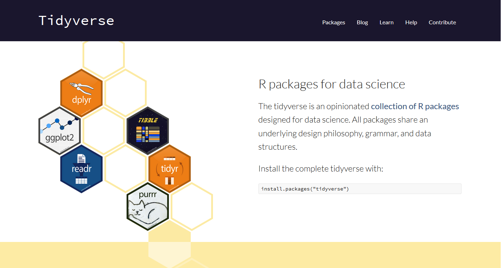

```{r setup, include=FALSE}
knitr::opts_chunk$set(echo = FALSE,fig.width = 4)
```

## About us - Lecturer and participants

Let's meet each other.

I'm Giulio Genova

Phd student in Soil Science at Unibz and Eurac

I work with R since my master thesis in 2017

<br/>
 
 


<br/>
<br/>
<br/>
<br/>
<br/>
<br/>

contatct: giulio.genova@eurac.edu 

## List of lectures for the course

- Intro to the course, R and RStudio
- **Data wrangling exploring and summarizing with dplyr**
- Plotting with ggplot2
- Cluster analysis or Principal component analysis

## List of topics for today

- Why dplyr and the tidyverse
- Data wrangling exploring and summarizing with dplyr
- Some practice
<br/>
<br/>
<br/>
&nbsp;  &nbsp; &nbsp; 


## What is the &nbsp; &nbsp;  

"The tidyverse is an opinionated collection of R packages designed for data science. All packages share an underlying design philosophy, grammar, and data structures"

- Easy grammar
- Huge community
- Nice documentation
- Cosidered the "state of the art"

{dplyr} and {ggplot2} are part of the tidyverse

## What is &nbsp; &nbsp; 

"dplyr is a grammar of data manipulation, providing a consistent set of verbs that help you solve the most common data manipulation challenges:"

    - mutate() adds new variables that are functions of existing variables
    - select() picks variables based on their names.
    - filter() picks cases based on their values.
    - summarise() reduces multiple values down to a single summary.
    - arrange() changes the ordering of the rows.

## what is tidy data
There are three interrelated rules which make a dataset tidy:

    - Each variable must have its own column.
    - Each observation must have its own row.
    - Each value must have its own cell.


Following three rules makes a dataset tidy: variables are in columns, observations are in rows, and values are in cells. 

## Help and documentation
Where do I go to find out more about this?

- Official Tidyverse[website](https://www.tidyverse.org/)
- Dplyr [page](https://dplyr.tidyverse.org/)
- Nice [presentation](https://www.slideshare.net/romainfrancois/dplyr-53923420) on Slidesahre



## Some Practice now

- We will now go on and take a look at Dplyr functions and syntax, see some exaples and do some practice

- We can also answer questions and see the excercises from the last lecture
